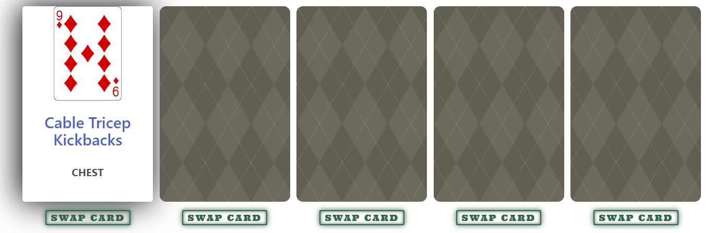

# **Body of Cards** - A Playing Card Workout Generator

## Description
Our motivation in this project stemmed from itself - motivation. A repetitive rubric of exercises becomes stale and boring which can lead to a lack of motivation to go to the gym or workout at home regularly. However, with our exercise randomizer app thinking of exercises has never been easier. It may even include workouts you've never seen or heard of before! Follow along with the convenient YouTube hyperlinks for the exercises and not only could you have a great poker hand, but an excellent body to go to with it. 

Let some luck into your workouts with ***Body of Cards***!

In this project we learned so much as a group, including how to manage multiple API calls, Object-Oriented Programming, hands-on CSS/HTML manipulation, and working together using Git.

## Table of Contents
- [Installation](#installation)
- [Usage](#usage)
- [Badges](#badges)
- [Features](#features)
- [Credits](#credits)
- [License](#license)

## Installation

Within preferred code editor, clone the following [GitHub Repository](https://github.com/Krenbot/body-of-cards).

## Usage
Click a back to reveal a card linked to an exercise.

Click remaining card backs to reveal up to 5 exercises and associated playing cards. Card suits are linked to muscle group: 

        CLUBS: ARMS
        DIAMONDS: CHEST
        SPADES: LEGS
        HEARTS: BACK
        
Card Numbers represent amount of reps. 

Ex: 7 of Diamonds = 7 reps of Weighted Plank. 5 of Diamonds = 5 reps of Barbell Front Squat, etc...

Face card values represent additional numbers of reps

        JACK: 11 
        QUEEN: 12
        KING: 13
        ACE: 14

Press the SWAP CARD button to swap once for a different random generated exercise and rep value. The SWAP CARD button will then be disabled for that card.

When ready to begin, hit START TIMER button and begin exercises. When finished, hit STOP and results will be stored to local storage. 

Compare your times and exercises with your friends or yourself to track improvement!

## Badges

## Features

- Personal Scoring
    - List of exercises are timestamped by date, recorded by time when the timer is started allowing users to maintain an in-app exercise history
    
 

- Mobile Friendly
    - Cards are neatly arranged on mobile screens
## Credits
[@pbp66](https://github.com/pbp66) - James Perry 
[@Krenbot](https://github.com/Krenbot) - Steven Krenn 
[@CodySaal](https://github.com/CodySaal) - Cody Saal 
[@OilPainter1](https://github.com/OilPainter1) - Henry Cryns

[Bulma Framework](https://bulma.io/) 
[Swap Button CSS](https://codepen.io/geekvie/pen/QWgVQpv) 
[Exercise API](https://rapidapi.com/mortimerbrian135/api/exerciseapi3) 
[Deck of Cards API](https://deckofcardsapi.com/) 
[Google Fonts Family - Ultra](https://fonts.googleapis.com/css?family=Ultra)

___
## License

MIT License

Copyright (c) 2022 
Steven Krenn/Cody Saal/James Perry/Henry Cryns

Permission is hereby granted, free of charge, to any person obtaining a copy
of this software and associated documentation files (the "Software"), to deal
in the Software without restriction, including without limitation the rights
to use, copy, modify, merge, publish, distribute, sublicense, and/or sell
copies of the Software, and to permit persons to whom the Software is
furnished to do so, subject to the following conditions:

The above copyright notice and this permission notice shall be included in all
copies or substantial portions of the Software.

THE SOFTWARE IS PROVIDED "AS IS", WITHOUT WARRANTY OF ANY KIND, EXPRESS OR
IMPLIED, INCLUDING BUT NOT LIMITED TO THE WARRANTIES OF MERCHANTABILITY,
FITNESS FOR A PARTICULAR PURPOSE AND NONINFRINGEMENT. IN NO EVENT SHALL THE
AUTHORS OR COPYRIGHT HOLDERS BE LIABLE FOR ANY CLAIM, DAMAGES OR OTHER
LIABILITY, WHETHER IN AN ACTION OF CONTRACT, TORT OR OTHERWISE, ARISING FROM,
OUT OF OR IN CONNECTION WITH THE SOFTWARE OR THE USE OR OTHER DEALINGS IN THE
SOFTWARE.
___
## How to Contribute

### Contributor Covenant Code of Conduct

#### Our Pledge

We as members, contributors, and leaders pledge to make participation in our
community a harassment-free experience for everyone, regardless of age, body
size, visible or invisible disability, ethnicity, sex characteristics, gender
identity and expression, level of experience, education, socio-economic status,
nationality, personal appearance, race, caste, color, religion, or sexual
identity and orientation.

We pledge to act and interact in ways that contribute to an open, welcoming,
diverse, inclusive, and healthy community.

#### Our Standards

Examples of behavior that contributes to a positive environment for our
community include:

* Demonstrating empathy and kindness toward other people
* Being respectful of differing opinions, viewpoints, and experiences
* Giving and gracefully accepting constructive feedback
* Accepting responsibility and apologizing to those affected by our mistakes,
  and learning from the experience
* Focusing on what is best not just for us as individuals, but for the overall
  community

Examples of unacceptable behavior include:

* The use of sexualized language or imagery, and sexual attention or advances of
  any kind
* Trolling, insulting or derogatory comments, and personal or political attacks
* Public or private harassment
* Publishing others' private information, such as a physical or email address,
  without their explicit permission
* Other conduct which could reasonably be considered inappropriate in a
  professional setting

#### Enforcement Responsibilities

Community leaders are responsible for clarifying and enforcing our standards of
acceptable behavior and will take appropriate and fair corrective action in
response to any behavior that they deem inappropriate, threatening, offensive,
or harmful.

Community leaders have the right and responsibility to remove, edit, or reject
comments, commits, code, wiki edits, issues, and other contributions that are
not aligned to this Code of Conduct, and will communicate reasons for moderation
decisions when appropriate.

#### Scope

This Code of Conduct applies within all community spaces, and also applies when
an individual is officially representing the community in public spaces.
Examples of representing our community include using an official e-mail address,
posting via an official social media account, or acting as an appointed
representative at an online or offline event.

### Enforcement

Instances of abusive, harassing, or otherwise unacceptable behavior may be
reported to the community leaders responsible for enforcement at
[INSERT CONTACT METHOD].
All complaints will be reviewed and investigated promptly and fairly.

All community leaders are obligated to respect the privacy and security of the
reporter of any incident.

### Enforcement Guidelines

Community leaders will follow these Community Impact Guidelines in determining
the consequences for any action they deem in violation of this Code of Conduct:

### 1. Correction

**Community Impact**: Use of inappropriate language or other behavior deemed
unprofessional or unwelcome in the community.

**Consequence**: A private, written warning from community leaders, providing
clarity around the nature of the violation and an explanation of why the
behavior was inappropriate. A public apology may be requested.

### 2. Warning

**Community Impact**: A violation through a single incident or series of
actions.

**Consequence**: A warning with consequences for continued behavior. No
interaction with the people involved, including unsolicited interaction with
those enforcing the Code of Conduct, for a specified period of time. This
includes avoiding interactions in community spaces as well as external channels
like social media. Violating these terms may lead to a temporary or permanent
ban.

### 3. Temporary Ban

**Community Impact**: A serious violation of community standards, including
sustained inappropriate behavior.

**Consequence**: A temporary ban from any sort of interaction or public
communication with the community for a specified period of time. No public or
private interaction with the people involved, including unsolicited interaction
with those enforcing the Code of Conduct, is allowed during this period.
Violating these terms may lead to a permanent ban.

### 4. Permanent Ban

**Community Impact**: Demonstrating a pattern of violation of community
standards, including sustained inappropriate behavior, harassment of an
individual, or aggression toward or disparagement of classes of individuals.

**Consequence**: A permanent ban from any sort of public interaction within the
community.

## Attribution

This Code of Conduct is adapted from the [Contributor Covenant][homepage],
version 2.1, available at
[https://www.contributor-covenant.org/version/2/1/code_of_conduct.html][v2.1].

Community Impact Guidelines were inspired by
[Mozilla's code of conduct enforcement ladder][Mozilla CoC].

For answers to common questions about this code of conduct, see the FAQ at
[https://www.contributor-covenant.org/faq][FAQ]. Translations are available at
[https://www.contributor-covenant.org/translations][translations].

[homepage]: https://www.contributor-covenant.org
[v2.1]: https://www.contributor-covenant.org/version/2/1/code_of_conduct.html
[Mozilla CoC]: https://github.com/mozilla/diversity
[FAQ]: https://www.contributor-covenant.org/faq
[translations]: https://www.contributor-covenant.org/translations
